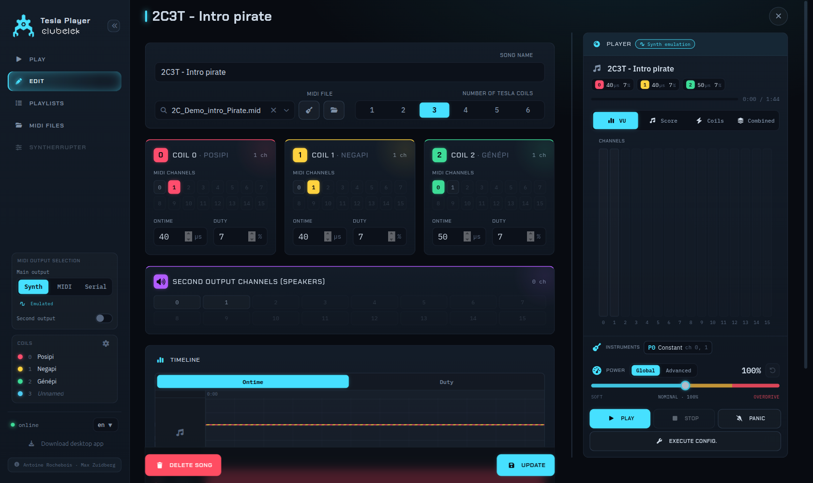

# User guide

← [Docs](./README.md) · [Project README](../readme.md)

How to play music on your Tesla coils and configure each song. This covers the web app and applies to the [desktop app](./desktop-app.md) too (same interface).

**Contents**

- [The interface at a glance](#the-interface-at-a-glance)
- [Choosing your outputs](#choosing-your-outputs)
- [Playing a song or playlist](#playing-a-song-or-playlist)
- [Live power control](#live-power-control)
- [Editing a song](#editing-a-song)
- [Playlists](#playlists)
- [MIDI files & instruments](#midi-files--instruments)
- [Language](#language)

---

## The interface at a glance

- **Sidebar (left)**: navigation (Play, Edit, Playlists, MIDI files, and Syntherrupter when connected), your **output selection**, the **coil legend**, and footer controls (connection status, language, desktop download / sync).
- **Main area**: the current screen (Play, Edit, ...)

## Choosing your outputs

Output selection lives in the sidebar and is remembered between sessions.

### First output (the coils)

Pick one of three modes:

- **Synth**: the built-in Web Audio emulation. Great for composing/previewing without hardware.
- **MIDI**: any MIDI output device the browser sees (a USB-MIDI interface to your coil setup).
- **Serial**: a **direct USB link to the Syntherrupter** (Web Serial). Click **Connect** and pick the device's serial port. Once connected, a **Syntherrupter** page appears in the sidebar so you can [configure the device itself](./syntherrupter.md). A previously authorized port reconnects automatically on the next launch.

### Second output (optional)

Toggle on a **second output** to mirror selected channels to another device (typically speakers playing alongside the coils). You choose **which MIDI channels** go to it (per song), and a **latency offset** slider lets you nudge it earlier/later to stay in sync with the coils (hardware interfaces have different delays).

### Coils & general config

The sidebar lists your coils with their colors and names. The ⚙ button opens **general configuration**: name each physical coil and set the **default coil count** used when creating new songs. This has no incidence on hardware behavior; names are just labels, and the coil count is just a default for the UI.

## Playing a song or playlist

Go to **Play**:

1. Pick a **song** (or a **playlist**) from the picker.
2. Press play.
3. **Autoplay** (toggle) starts the next track automatically when one ends.

## Live power control

While a song plays you can ride the output **live**:

- **Global mode**: a single **Power** fader scales the whole performance up/down.
- **Advanced mode**: switch to per-coil control of **on-time** and **duty** for fine balancing between coils.

Live changes are sent to the coils immediately and don't alter the saved song. The values you can reach live are bounded by the coil's **hardware safety limits** on the Syntherrupter (see [Configuring the Syntherrupter](./syntherrupter.md)), not by software.

## Editing a song

Go to **Edit** and create or open a song. A song is a MIDI file plus a **per-coil configuration**.

- **Name** and **MIDI file**: choose the file this song plays (upload new ones from the MIDI file manager, reachable from the picker).
- **Coil count**: how many physical coils this song targets (1–6).
- **Per-coil cards** :for each coil:
  - **MIDI channels**: which channels of the file feed this coil (a multi-select grid). The timeline below colors notes by their channel→coil mapping so you can see who plays what.
  - **On-time (µs)** and **Duty (%)**: the coil's power for this song (bounded by the device's safety envelope).
- **Second-output channels**: which channels mirror to the second output for this song.
- **Timeline**: **mid-song automation**: on-time / duty changes over time, per coil.

Press **Save** (or **Update**). When the server has [authentication](./authentication.md) enabled, the song records **who last edited it**, shown as a small "edited by ..." line.

### Worked example

In this 3-coil setup, **coils 0 and 1 play channel 1** and **coil 2 plays channel 0** of the MIDI file. The coils run at maximum on-times of **40 / 30 µs** and duty-cycles of **3 % / 2.1 %**. All 16 channels are allowed on both outputs.

## Playlists

Go to **Playlists** to group songs into an ordered set for a show. A playlist targets a specific **coil count**; only songs authored for that count are meant to play. Reorder, add and remove songs, then play the playlist from the Play screen (with autoplay for a hands-off set).

## MIDI files & instruments

The **MIDI files** manager lets you **upload**, **download** and **delete** the `.mid` files your songs use. Each file also has a **per-channel instrument editor**: it rewrites the file's Program Changes so a given channel plays a chosen instrument from the start.

> ⚠️ Editing a file's instruments changes the **file itself**, so it affects **every song** that uses that file.

## Language

The footer language selector switches the whole UI between **English** and **French**; your choice is remembered. Want another language? See [Development → Internationalization](./development.md#internationalization).
