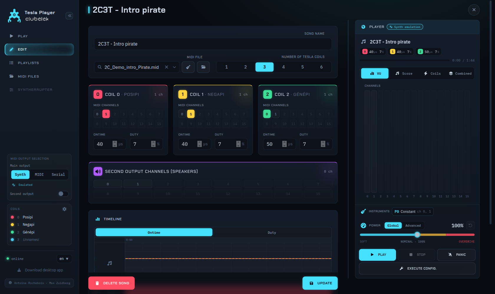

# User guide

← [Docs](./README.md) · [Project README](../readme.md)

How to play music on your Tesla coils and configure each song. This covers the web app and applies to the [desktop app](./desktop-app.md) too (same interface).

**Contents**

- [The interface at a glance](#the-interface-at-a-glance)
- [Choosing your outputs](#choosing-your-outputs)
- [Playing a song or playlist](#playing-a-song-or-playlist)
- [Live power control](#live-power-control)
- [Editing a song](#editing-a-song)
- [Playlists](#playlists)
- [MIDI files & instruments](#midi-files--instruments)
- [Envelopes](#envelopes)
- [Language](#language)

---

## The interface at a glance

- **Sidebar (left)**: navigation (Play, Edit, Playlists, MIDI files, Envelopes, Tuning, and Syntherrupter when connected), your **output selection**, the **coil legend**, and footer controls (connection status, language, desktop download / sync).
- **Main area**: the current screen (Play, Edit, ...)

## Choosing your outputs

Output selection lives in the sidebar and is remembered between sessions.

### First output (the coils)

Pick one of three modes:

- **Synth**: the built-in Web Audio emulation. Great for composing/previewing without hardware.
- **MIDI**: any MIDI output device the browser sees (a USB-MIDI interface to your coil setup).
- **Serial**: a **direct USB link to the Syntherrupter** (Web Serial). Click **Connect** and pick the device's serial port. Once connected, a **Syntherrupter** page appears in the sidebar so you can [configure the device itself](./syntherrupter.md). A previously authorized port reconnects automatically on the next launch.

### Second output (optional)

Toggle on a **second output** to mirror selected channels to another device (typically speakers playing alongside the coils). You choose **which MIDI channels** go to it (per song), and a **latency offset** slider lets you nudge it earlier/later to stay in sync with the coils (hardware interfaces have different delays).

### Coils & general config

The sidebar lists your coils with their colors and names. The ⚙ button opens **general configuration**: name each physical coil and set the **default coil count** used when creating new songs. This has no incidence on hardware behavior; names are just labels, and the coil count is just a default for the UI.

## Playing a song or playlist

Go to **Play**:

1. Pick a **song** (or a **playlist**) from the picker.
2. Press play.
3. **Autoplay** (toggle) starts the next track automatically when one ends.

## Live power control

While a song plays you can ride the output **live**:

- **Global mode**: a single **Power** fader scales the whole performance up/down.
- **Advanced mode**: switch to per-coil control of **on-time** and **duty** for fine balancing between coils.

Live changes are sent to the coils immediately and don't alter the saved song. The values you can reach live are bounded by the coil's **hardware safety limits** on the Syntherrupter (see [Configuring the Syntherrupter](./syntherrupter.md)), not by software.

## Editing a song

Go to **Edit** and create or open a song. A song is a MIDI file plus a **per-coil configuration**.

- **Name** and **MIDI file**: choose the file this song plays (upload new ones from the MIDI file manager, reachable from the picker).
- **Coil count**: how many physical coils this song targets (1–6).
- **Per-coil cards** :for each coil:
  - **MIDI channels**: which channels of the file feed this coil (a multi-select grid). The player on the right colors notes by their channel→coil mapping so you can see who plays what.
  - **On-time (µs)** and **Duty (%)**: the coil's power for this song (bounded by the device's safety envelope).
- **Second-output channels**: which channels mirror to the second output for this song.

Press **Save** (or **Update**). When the server has [authentication](./authentication.md) enabled, the song records **who last edited it**, shown as a small "edited by ..." line.

### Power over time

The **Power over time** section varies the coils' power along the song. Switch it on, then:

- **Shape the Song curve**: it sets every coil's power (100 % = the settings on the coil cards, up to 200 %). Double-click the track to add a point, drag a point to move it (it snaps to the beats of the file, hold Alt to place it freely), Delete removes the selected one. **Add at …** puts a point where the player is: pause at the chorus, one click.
- **Choose each point's transition**: *Instant* (the level jumps there) or *Gradual* (a ramp from the previous point), for rises, fades and crescendos. **Intro rise** and **Fade out** build the usual ones.
- **Per coil** adds a track per coil, for its ontime or duty: it multiplies the Song curve, for a solo or a balance that changes during the song.
- The list under the tracks holds the exact time, level and transition of every point.

What a coil gets is its setting × the Song curve × its own curve × the player's live **Power** fader: the fader always applies on top, so it stays your safety control during a show. The player's coil lanes show each coil at that level.

### Spatialisation

The **Spatialisation** section spreads the notes across the coils by position, so a melody can travel from one coil to the next. Switch it on, then:

- **Place the coils** on the stage, from left to right: drag a coil's marker (or focus it and use the arrow keys), and its reach with the diamonds on its band. **Space evenly** spreads them the way the Syntherrupter suggests.
- **Choose how a note passes from one coil to the next**: *Fade* (the volume drops with the distance, the note glides) or *One at a time* (full volume inside the reach, nothing past it).
- **Choose, per channel, where its notes sit**: the **file's pan** (CC10, the default), their **pitch** (each note, or the lowest, highest or loudest one sounding, over a note range, low notes on the left or on the right), or **everywhere** (every coil assigned the channel plays all of it).

A coil only plays the channels it is assigned: the section warns when a channel sits out of reach of all its coils (it would not play), or when it is assigned to a single coil (it cannot move). The player's coil lanes show what each coil actually plays, fainter when quieter, and the built-in synth pans the sound left and right the same way.

The player sends the spatialisation before each song, and switches it off for songs without it (and for Live mode and tuning), so a song never inherits the previous one's.

### Worked example

In this 3-coil setup, **coils 0 and 1 play channel 1** and **coil 2 plays channel 0** of the MIDI file. The coils run at maximum on-times of **40 / 30 µs** and duty-cycles of **3 % / 2.1 %**. All 16 channels are allowed on both outputs.

## Playlists

Go to **Playlists** to group songs into an ordered set for a show. A playlist targets a specific **coil count**; only songs authored for that count are meant to play. Reorder, add and remove songs, then play the playlist from the Play screen (with autoplay for a hands-off set).

## MIDI files & instruments

The **MIDI files** manager lets you **upload**, **download** and **delete** the `.mid` files your songs use. Each file also has a **per-channel instrument editor**: it rewrites the file's Program Changes so a given channel plays a chosen instrument from the start.

> ⚠️ Editing a file's instruments changes the **file itself**, so it affects **every song** that uses that file.

## Envelopes

An envelope shapes a note's ontime from note-on to note-off: a sharp piano-like attack, a slow pad, a pulsation… On the Syntherrupter a channel picks one by its **program number** (a MIDI Program Change), so the per-channel instrument editor above is where a file chooses its envelopes.

The **Envelopes** screen lists the firmware's built-in envelopes (**P0–P19**, read-only) and your own (**P20–P63**):

- **Create** one from scratch, or **duplicate** any envelope (built-in or yours) to start from its shape.
- **Edit** it on the graph: drag each step's point (its duration and amplitude), the release point, or the note-off line to see how a shorter or longer note plays; double-click the curve to add a step there. The table below holds the exact values of each step, in playing order: amplitude (a multiplier of the note ontime, 1 = nominal), duration and curve (n-tau: 0 = linear). Add a step with **+**, remove one with its **×** (up to 7 steps, plus the release).
- **Choose what a held note does after the last step**: *Hold the level* (sustain until note-off), *Loop* from a given step (pulsation, tremolo), or *Release* straight away, even while the note is held (a one-shot). The release, played at note-off, has its own column.
- **Listen** with **Synth** (the emulation, even before saving), or **Coil**: it sends the envelope to the device and plays the note on the coil you pick, at the ontime you set, with every other coil muted.
- The screen shows which MIDI files use the envelope, and warns before deleting or moving one they play.

Your envelopes live in the app's library (and are [synced](./desktop-app.md#synchronizing-with-a-server) like songs). The player sends the ones a song uses to the device **before each song**, so there is nothing to save on the Syntherrupter itself. The amplitude may exceed 1 for a punchier attack; the device still caps the result at the coil's [safety limits](./syntherrupter.md).

## Tuning the primary with a camera

The **Tuning** screen helps with the "accord" of a coil: moving the primary tap so the primary resonates with the loaded secondary. Instead of judging arc length by eye between two tap positions, a phone placed on a stand measures it. The full procedure, its safety rules and what the numbers mean are in [Camera-assisted tuning](./tuning.md).

## Language

The footer language selector switches the whole UI between **English** and **French**; your choice is remembered. Want another language? See [Development → Internationalization](./development.md#internationalization).
