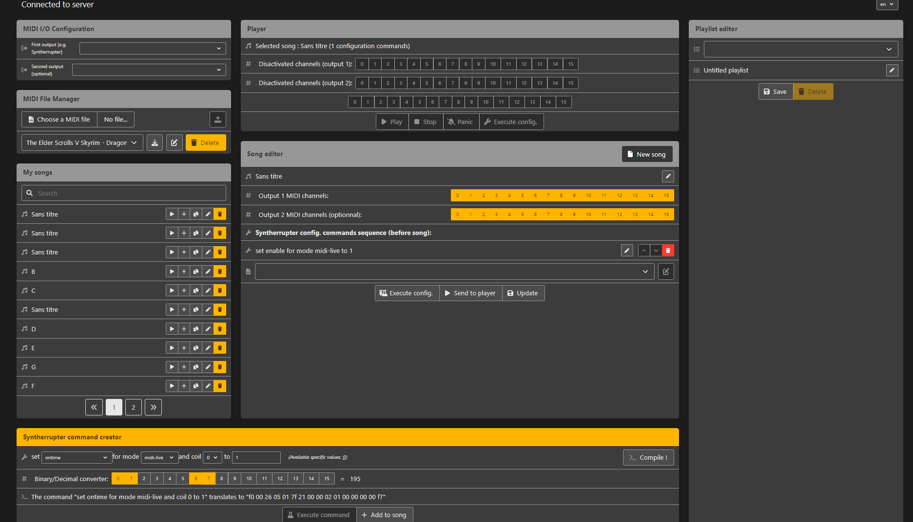
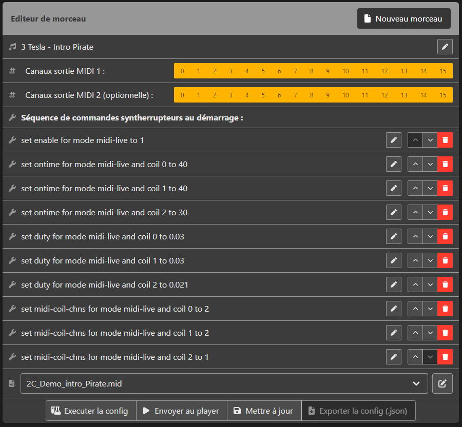

# Tesla Coil Synterrupter Web Player

This project is a MIDI player web app specifically designed for operating musical Tesla Coils running on the wonderful [MMMZZZ's Syntherrupter](https://github.com/MMMZZZZ/Syntherrupter), a polyphonic/multi-coils interrupter.

This project was initialy developped for the high voltage team of the Clubelek (the electronics student club of INSA Lyon, a french engineering school) and its 3 Tesla coils.

It aims to provide a simple but yet complete interface to define a Syntherrupter configuration for each song (MIDI channels mapping, on times & duty-cycles configuration...) and playing these songs on the Syntherrupter. 

The goal was to avoid using complex MIDI editors for registering the SYSEX commands, to have a centralized platform for our MIDIs/configs and to be able to operate our coils fastly during shows.




## Features

The main features of this tool are:
- A web MIDI player able to play MIDI on 1 or 2 of the computer MIDI outputs
- A MIDI channel filtering option to map channels to each of the 2 outputs (for using another synth in parrallel of the Tesla coils)
- A playlist editor
- A MIDI file uploader/manager
- The integration of a modded version of Signal, a powerful online MIDI editor to edit and test the MIDI directly into your navigator
- A song editor/creator (a "song" is an association of configuration commands and of a MIDI file)
- A Syntherrupter SYSEX command creator (implementing [MMMZZZZ's Syfoh](https://github.com/MMMZZZZ/Syfoh) under the hood) to create syntherrupter configs and add them to songs


## Documentation

We are currently working on it :)

See the Syfoh and Syntherrupter documentation in order to understand the Syntherrupter SYSEX (system exclusive) MIDI commands. (Links in the Credits section)

### Song example configuration



In this example, we have a setup of 3 Tesla coils, the coil 0 and 1 are playing the channel 1 (2 = 0000 0000 000 0010) and the coil 2 is playing the channel 0 (1 = 0000 0000 000 0001) of the provided MIDI file. 

The Tesla coils are respectively running with maximum on-times of 40/30µs and duty-cycles of 3%/2.1%.

All the 16 channels are allowed on both outputs.


## Installation and running (localy)

### Standard install

In order to run the app, use a release from this repository or clone this repo and enter the follwing terminal commands in the 'flask-backend' folder. (You must have Python3 and PIP installed)

The first time:
```bash
pip3 install -r requirements.txt
python3 init_db.py
python3 app.py
```

Any other time:
```bash
python3 app.py
```

The web server is now running on localhost:5000 and the songs/configuration are saved in this 'flask-backend' folder. 

You can now connect to http://localhost:5000 with your web navigator ! (IMPORTANT: Firefox, Safari and Internet Explorer are not implementing the WebMIDI API and the web app will therefore not work on these navigators)

### Dockerized install 

There is also a Dockerfile if you know how to use/prefer a dockerized environnement (in this case, we strongly advice you to use a docker-compose configuration in order to backup the DB)

The first time, in the flask-backend or release folder, run:
```bash
docker build -t tesla-player .
docker run -p 5000:5000 tesla-player
```

Any other time, just run:
```bash
docker run -p 5000:5000 tesla-player
```

You can now connect to http://localhost:5000 with your web navigator !


## Deploying or recompiling the project (address change, etc) for web hosting

The frontend of this app is developped using Vue.js (tesla-player folder) and the backend using Flask/SQLite under Python3. Futhermore, it implements Signal (a React app).

To deploy to a custom server (and changing the server address) you will need to rebuild the frontend sources.

In order to change the default address (http://localhost:5000) you must rebuild theses frontends, change their .env files and put the binaries in the 'public' folder of the 'flask-backend'. More instructions comming soon. In the meantime feel free to reach me ;)


### Authentication (advices)

In order to perform authentication, we strongly advice you to use this web app Docker image. we advice you to use a Docker proxy such as Traefik's native basicauth feature or keycloak gatekeeper (if you are using a Keycloak SSO)


## Internationalization

This tool is currently available in the following languages:
- English
- French

If you want to contribute, feel free to reach us ! It requires no programming skills ;)

## Contributing

This project is fully open source, feel free to modify it! Any contribution (using Github pull requests) are obviously welcome.

We well also be glad to ear your features requests and comments using Github issues.

## Credits

[MMMZZZ's Syntherrupter](https://github.com/MMMZZZZ/Syntherrupter)

[MMMZZZZ's Syfoh](https://github.com/MMMZZZZ/Syfoh)

[Ryohey's Signal MIDI editor](https://github.com/ryohey/signal)

[Ryoyakawai's smfplayer](https://github.com/ryoyakawai/smfplayer)
