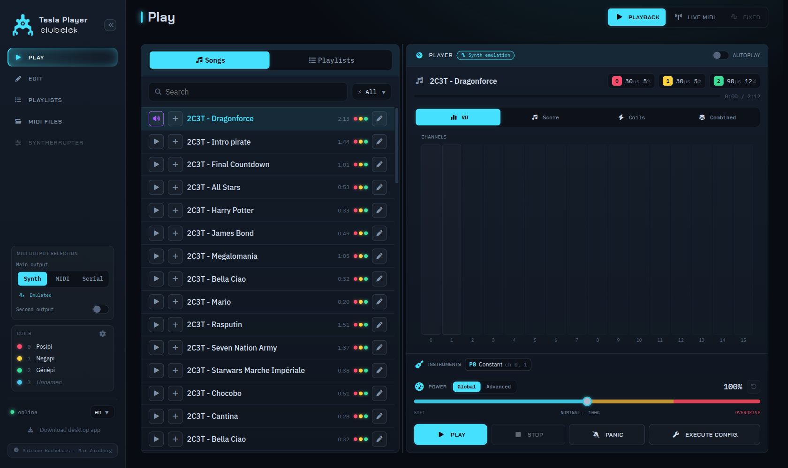

# Tesla Coil Synterrupter Web Player

This project is a MIDI player web app specifically designed for operating musical Tesla Coils running on the wonderful [MMMZZZ's Syntherrupter](https://github.com/MMMZZZZ/Syntherrupter), a polyphonic/multi-coils interrupter.

This project was initialy developped for the high voltage team of the Clubelek (the electronics student club of INSA Lyon, a french engineering school) and its 3 Tesla coils.

It aims to provide a simple but yet complete interface to define a Syntherrupter configuration for each song (MIDI channels mapping, on times & duty-cycles configuration...) and playing these songs on the Syntherrupter.

The goal was to avoid using complex MIDI editors for registering the SYSEX commands, to have a centralized platform for our MIDIs/configs and to be able to operate our coils fastly during shows.



## Features

The main features of this tool are:
- A web MIDI player able to play MIDI on 1 or 2 of the computer's MIDI outputs
- A built-in **Tesla-coil sound emulation** (Web Audio synth), used as the default output when no hardware Syntherrupter is connected — so you can compose and preview without a coil
- Per-song, per-coil configuration: map MIDI channels to coils, set each coil's on-time and duty-cycle
- A timeline to author **mid-song automation** (on-time / duty changes over time) per coil
- **Live power control** while playing (a master "power" knob, switchable to per-coil on-time/duty)
- A second-output channel filter (e.g. to drive monitor speakers in parallel of the coils), with a manual latency offset to align it with the coils
- A playlist editor
- A MIDI file manager (upload / download / delete) with a **per-channel instrument editor** that rewrites the MIDI file's program changes
- A standalone **desktop app** (Electron, Linux/Windows) that embeds the backend for fully offline use, with optional one-click **synchronization** to a remote server (choose, per item, which side to keep)
- Available in English and French

## Documentation

See the Syfoh and Syntherrupter documentation in order to understand the Syntherrupter SYSEX (system exclusive) MIDI commands. (Links in the Credits section)

> Note: the WebMIDI API is required, so the player works in Chromium-based browsers (Chrome, Edge, Opera…). Firefox and Safari do not implement WebMIDI.

### Song example configuration


In this example, we have a setup of 3 Tesla coils, the coil 0 and 1 are playing the channel 1 (2 = 0000 0000 000 0010) and the coil 2 is playing the channel 0 (1 = 0000 0000 000 0001) of the provided MIDI file.

The Tesla coils are respectively running with maximum on-times of 40/30µs and duty-cycles of 3%/2.1%.

All the 16 channels are allowed on both outputs.

## Stack

- **Front-end** — `tesla-player/`: Vue 3 + Vite + TypeScript (Pinia, vue-router, vue-i18n).
- **Back-end** — `nest-backend/`: NestJS + TypeORM over SQLite, serving the REST API under `/api` and (in production) the built front-end.

## Installation and launch

### Development

Run the two dev servers side by side. The front (port `8080`) talks to the back (port `5000`) via `VITE_BASE_URL` in `tesla-player/.env`.

Back-end:
```bash
cd nest-backend
npm install
npm run init:db   # first run only — creates database.db (+ schema) at the repo root
npm run start:dev # http://localhost:5000  (REST API under /api)
```

Front-end:
```bash
cd tesla-player
npm install
npm run dev       # http://localhost:8080
```

Open http://localhost:8080. The SQLite database and the uploaded MIDI files are stored at the repository root (`database.db`, `uploads/`).

### Production (Docker)

A single container builds the front-end, builds the back-end, and serves both on one port. The database and uploaded files are persisted in `./data`.

```bash
docker compose up --build
```

Open http://localhost:5000. To put it behind a reverse proxy / change the port, edit the `ports` mapping in `docker-compose.yml`. The database (`/data/database.db`) is created automatically on first boot; TypeORM migrations run on every start.

### Desktop app (Electron)

`electron/` packages a standalone desktop build that **embeds the NestJS backend** (its own SQLite database + uploads under your user profile), so it runs **fully offline** — no server required. It can optionally **synchronize** songs, MIDI files and playlists with a remote Tesla Player server: a button opens a diff of what differs between this computer and the server and lets you choose, per item, which side to keep (**add/update only — sync never deletes**). The remote URL and optional HTTP basic-auth credentials are set from *File ▸ Server configuration* (the password is stored encrypted via Electron `safeStorage`, never in the page).

**Build the binaries (on a Linux host):**

```bash
cd electron
npm install                 # downloads Electron + electron-builder
npm run build:electron      # builds front + back, rebuilds sqlite3 for Electron, then packages
```

Artifacts land in `electron/dist-electron/` (a Linux `*.AppImage` and a Windows `*.exe`). Building the Windows `.exe` from Linux requires **Wine**; without it, only the Linux AppImage is produced.

**Offer the downloads from the hosted web app:** drop the built artifacts into the server's `data/electron/` folder (i.e. `{DATA_ROOT}/electron`, already mounted by `docker-compose.yml`). The web build then shows a *Download desktop app* button at the bottom of the sidebar listing whichever platforms are present (a missing platform is simply hidden). The sync / server-config UI appears **only** in the desktop app; the download button appears **only** in the web build.

> The Electron artifacts are built locally and dropped into the data volume — they are **not** built inside the Docker image (cross-building Electron/Wine in the slim runtime image is not feasible).

### Authentication (important)

The REST API has **no built-in authentication** and binds all interfaces by default. The endpoints under `/api/songs`, `/api/midi`, `/api/playlists` and `/api/sync/*` mutate state, so for any networked deployment you **must** put the container behind a reverse proxy that enforces auth — e.g. Traefik's basic-auth middleware (the desktop app sends those same basic-auth credentials when syncing), or a Keycloak gatekeeper if you run a Keycloak SSO. The desktop app's embedded backend binds only `127.0.0.1`, so it is never exposed on the LAN.

## Internationalization

This tool is currently available in the following languages:
- English
- French

If you want to contribute, feel free to reach us ! It requires no programming skills ;)

## Contributing

This project is fully open source, feel free to modify it! Any contribution (using Github pull requests) are obviously welcome.

We well also be glad to ear your features requests and comments using Github issues.

## Credits

[MMMZZZ's Syntherrupter](https://github.com/MMMZZZZ/Syntherrupter)

[MMMZZZZ's Syfoh](https://github.com/MMMZZZZ/Syfoh)

[Ryoyakawai's smfplayer](https://github.com/ryoyakawai/smfplayer)
